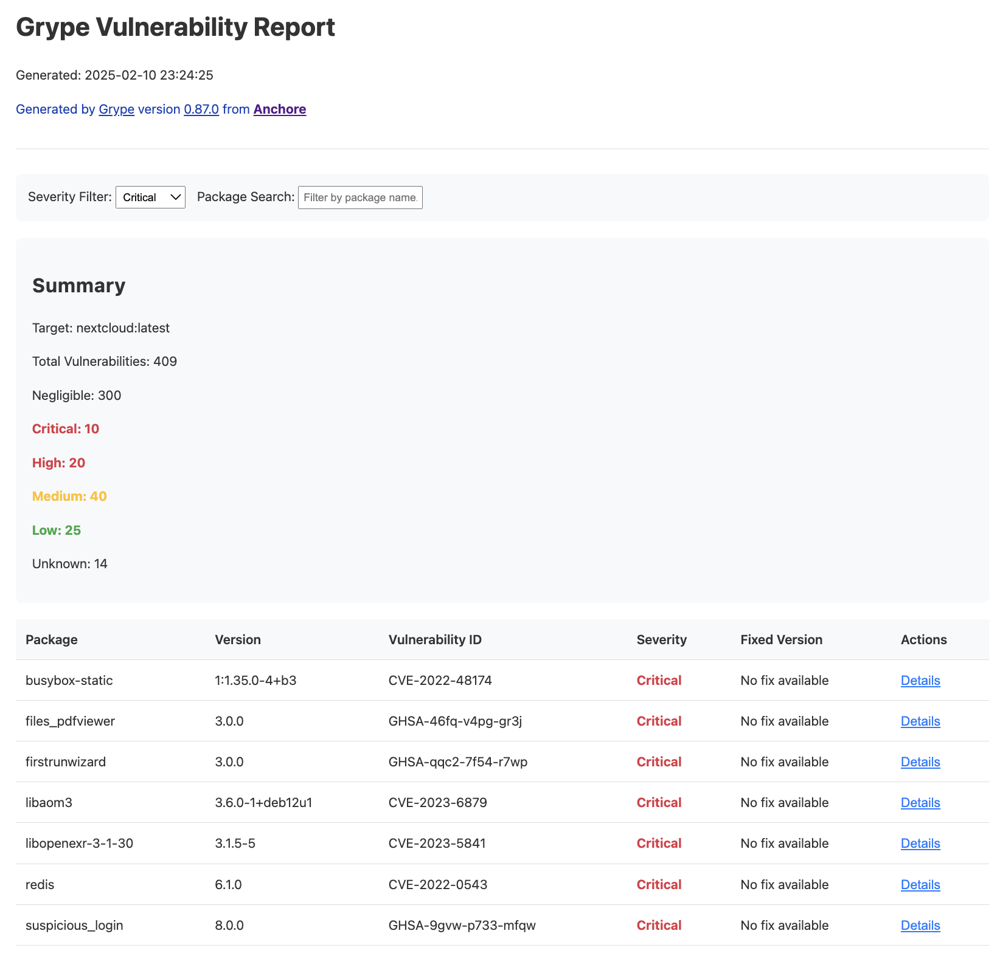

# grype2html

Convert [Grype](https://github.com/anchore/grype) vulnerability scan results into interactive HTML reports.



## Features

* Generate standalone HTML reports from Grype JSON output
* Interactive filtering by severity and package name
* Expandable vulnerability details
* No external dependencies - everything is self-contained in a single HTML file
* Mobile-friendly responsive design
* Clean, modern interface using system fonts
* Color-coded severity indicators
* Detailed vulnerability information including:
  * Package details
  * Vulnerability IDs
  * Severity levels
  * Fix versions
  * Related vulnerability descriptions
  * Reference URLs

## Background

[Grype](https://github.com/anchore/grype) is a vulnerability scanner from [Anchore](https://anchore.com/) that can analyze various artifacts, including container images and filesystems. While Grype supports multiple output formats, including JSON and table formats, some users need to share results in a more accessible format.

This tool bridges that gap by converting Grype's JSON output into interactive HTML reports that can be easily shared, viewed in any web browser, and optionally converted to PDF.

## Installation

```bash
# Clone the repository
git clone https://github.com/popey/grype2html
cd grype2html

# Make the script executable
chmod +x grype2html.py
```

## Usage

grype2html can be used in a pipeline with Grype:

```bash
# Scan an image and generate HTML report
grype alpine:latest -o json | ./grype2html.py

# Scan a directory and generate HTML report
grype /path/to/dir -o json | ./grype2html.py

# Scan from a Grype JSON file
cat grype-results.json | ./grype2html.py
```

The script will generate an HTML file with a timestamp in the filename (e.g., `grype_20250210T225647.html`).

## Report Features

### Summary Section
* Total number of vulnerabilities
* Breakdown by severity
* Target information
* Grype version information

### Interactive Controls
* Filter vulnerabilities by severity (Critical, High, Medium, Low)
* Search/filter by package name
* Expandable details for each vulnerability

### Detailed Information
* Package name and version
* Vulnerability ID
* Severity (color-coded)
* Available fix versions
* Detailed vulnerability descriptions
* Reference URLs

## Requirements

* Python 3.6 or later
* Input must be valid Grype JSON output

## Contributing

Contributions are welcome! Please feel free to submit a Pull Request. For major changes, please open an issue first to discuss what you would like to change.

## License

This project is licensed under the MIT License - see the LICENSE file for details.

## Credits

* [Anchore](https://anchore.com) for creating [Grype](https://github.com/anchore/grype)
* [TheGr8CodeWarrior](https://www.reddit.com/user/TheGr8CodeWarrior) for [suggesting](https://www.reddit.com/r/homelab/comments/1im9p3p/what_do_homelabers_use_for_vulnerability_scanning/mc2wz4a/?context=3) this improvement in [r/homelab](https://www.reddit.com/r/homelab). See also [Grype issue 2199](https://github.com/anchore/grype/issues/2199).
